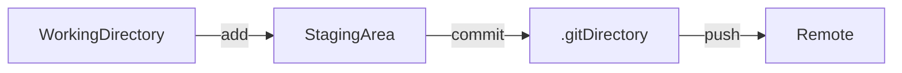

# git command

### editor 설정하기
>git (vscode)로 설정 파일 열기 
>vscode에서 추가해준다
```
git config --global core.editor "code --wait" //--wait은 vscode가 닫힐때 까지 기다린
git config --global -e //설정파일을 vscode로 열기
다 
```	

### 깃 기본 설정하기
```
git config user.name "이름"
git config user.email "메일"
```

### auto CRLF(문자입력타입) 설정
>CRLF방식에 따라 설정을 해줘야 한다
```
//windows에서는 true사용하고 mac에서는 false로 설정해준
git config core.autocrlf true 다
```

### 설정 확인
```
git config --list
```

### git 초기화
>git과 연관된 파일을 생성해준다
```
git init
```

### git 삭제 
>git과 연관된 파일을 삭제한다
```
rm -rf .git //숨김파일 삭제
```

### git 상태 확인

```
git status
```
### alias 설정
```
git config --global alias.[약어] [명령어]
git config --global alias.st status
```
  
### Git 이해하기
~~그래프로 그림을 그려보고 어려우면 그림파일 첨부~~
git은 아래와 같이 이루어져 있다
working directory --- add --- staging area -- push -- .git directory



```
git add [파일명]
git commit -m ["메세지"]
git commit -am ["메세지"]	//옵션에서 a는 모든 파일, m은 메세지의 옵션이다
git push [파일명]
git pull
```

### diff  파일 비교
> 파일 비교도 editor에서 확인 할 수 있다
```
//설정 방법
git config --global -e
//설정 파일에서 아래 내용을 추가 해준다
[difftool "vscode"]
	cmd = code --wait --diff $LOCAL $REMOTE
```
>비교
```
git diff

git difftool	//vscode에서 확인 가능하다
git difftool --staged 	//staged에 있는 파일과 비교
```

### add 취소하기
```
git reset HEAD [file명]
```
  
### commit 취소하기
```
git reset --soft HEAD^
```

### remote 저장소 추가하기
> remote저장소를 추가해준다(저장소의 내용을 끌어오진 않음)
```
git remote add [저장소명] [repository 주소]
git remote add TIL https://github.com/GuNu-Kim/TIL.git
```

### clone하기
>원격 저장소의 파일을 끌어온다 
```
git clone [repository 주소]
git clone https://github.com/GuNu-Kim/TIL.git
```

### branch 확인
```
git branch
```

### branch 생성
```
git branch [branch 명]
git branch test
```

### branch 이동
```
git checkout [branch명]
git checkout test
git checkout master
```

### branch 삭제
```
git branch -d [branch명]
git branch -d test
```
---

> 체크박스, 링크, 코드박스, 이미지
- [ ] [GitHub](http://github.com)
- [ ] [Google](http://google.com)

```java
if(java==true){
	retunr true;
}else{
	return false;
}
```
